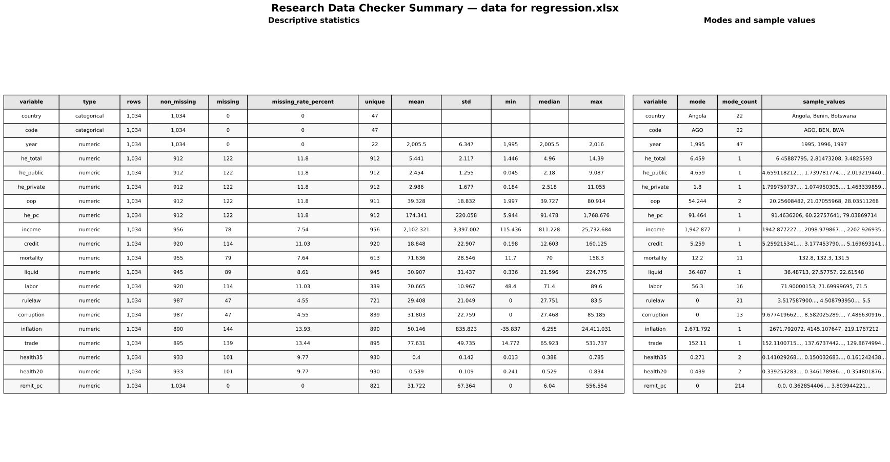

# Research Data Checker

[](https://github.com/kiyomoto0801/research-data-checker/actions/workflows/ci.yml)
[](https://www.python.org/)
[](LICENSE)

CSV・Excel形式の研究データを読み込み、**記述統計量の作成**と**基本的なデータ品質チェック**を一度に行うコマンドラインツールです。分析前の確認作業を短縮し、欠損や重複などの見落としを減らすことを目的としています。

## 主な機能

- 数値変数：観測数、平均、標準偏差、最小値、中央値、最大値、最頻値
- カテゴリ変数：種類数、最頻値、出現回数、サンプル値
- 全変数：欠損数、欠損率、ユニーク数
- 品質チェック：完全重複、欠損率、定数列、負の値、無限値
- 任意のID列の組み合わせ重複チェック
- `summary.xlsx`と`warnings.txt`への出力
- UTF-8および日本語版Excel由来のCP932 CSVに対応

> 警告は「誤りの断定」ではなく「確認した方がよい箇所」です。負の成長率など、研究上正しい値もあります。

## 出力例



## Codespacesで最短実行

1. リポジトリ上部の **Code → Codespaces → Create codespace on main** を押します。
2. Codespacesのターミナルで次を実行します。

```bash
python -m pip install -e .
research-data-checker sample_data/sample_data.csv
```

成功すると次のファイルができます。

```text
output/
├── summary.xlsx
└── warnings.txt
```

`summary.xlsx`はCodespaces上で直接表示できない場合があります。ファイルを右クリックして **Download** を選び、Excelで開いてください。

## 自分のデータを使う

研究データは`data`フォルダに入れます。`data/`は`.gitignore`に登録されているため、通常はGitHubへ送信されません。

```bash
mkdir -p data
research-data-checker "data/data for regression.xlsx"
```

ファイル名に空白がある場合は、パス全体を`" "`で囲みます。

### パネルデータのID重複を確認

```bash
research-data-checker "data/data for regression.xlsx" \
  --id-cols household_id year
```

### 欠損率の警告基準を20%に変更

```bash
research-data-checker "data/data for regression.xlsx" \
  --missing-threshold 0.20
```

### Excelのシートを指定

```bash
research-data-checker "data/data for regression.xlsx" --sheet Sheet1
```

## オプション

```text
usage: research-data-checker INPUT_FILE [options]

--output-dir DIR           出力先（初期値: output）
--missing-threshold FLOAT  欠損率の警告基準（初期値: 0.10）
--id-cols COL [COL ...]    行を一意にする列の組み合わせ
--sheet SHEET              Excelのシート名または0始まりの番号
--version                  バージョン表示
```

## 開発環境

```bash
git clone https://github.com/kiyomoto0801/research-data-checker.git
cd research-data-checker
python -m venv .venv
source .venv/bin/activate   # Windows: .venv\Scripts\activate
python -m pip install -e ".[dev]"
```

### テストとコードチェック

```bash
pytest
ruff check .
```

GitHubへpushまたはPull Requestを作成すると、GitHub ActionsがPython 3.11・3.12で上記のチェックを自動実行します。

### ベンチマークの再実行

```bash
python scripts/benchmark.py
```

結果は`benchmarks/benchmark_results.csv`と、ベクター形式の`benchmarks/benchmark.pdf`に保存されます。

## ディレクトリ構成

```text
src/research_data_checker/   本体コード
tests/                       単体テスト
.github/workflows/ci.yml     CI設定
sample_data/                 公開用サンプルデータ
docs/images/                 README用画像
scripts/benchmark.py         検証用スクリプト
benchmarks/                  ベンチマーク結果とPDF図
```

## ライセンス

[MIT License](LICENSE)
